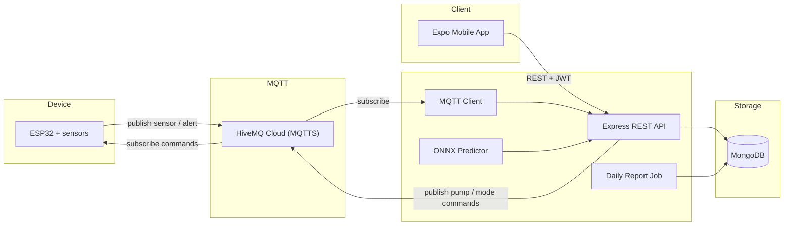

# Smart Agriculture System

A real-time smart farming system for sensor monitoring and irrigation control. An ESP32 collects field data and publishes it over MQTT; a Node.js backend stores readings, raises alerts, and issues pump commands; an Expo mobile app lets you monitor the farm and switch between **Manual**, **Auto**, and **AI** modes.

**Production API:** [https://smart-agriculture-system-f2wg.onrender.com/api-docs](https://smart-agriculture-system-f2wg.onrender.com/api-docs)

## Features

- Live monitoring of temperature, air humidity, soil moisture, water level, and battery
- Three pump-control modes: manual, scheduled/threshold auto, and AI (ONNX model)
- MQTT alerts when soil is dry, the tank is low, or the pump runs too long
- Daily statistical reports (min / max / avg) generated by GitHub Actions
- JWT authentication on mobile, with tokens stored in Secure Store
- Safe fallback: if the heartbeat is lost while in AI mode, the device switches back to Auto

## Architecture



Main data flow:

1. The ESP32 reads DHT11, soil moisture, ultrasonic water level, and INA219 battery every 5 seconds
2. Sensor JSON is published to the sensor topic; alerts are published to the alert topic
3. The backend subscribes, writes to MongoDB, creates alerts, and (in AI mode) runs the ONNX model
4. Control commands (`mode`, `pump`, thresholds) are HMAC-SHA256 signed, then published back to the device
5. The mobile app calls the REST API to view overview, alerts, and reports, and to change configuration

## Tech stack

| Layer | Technology |
| --- | --- |
| Firmware | ESP32 (Arduino / PlatformIO), DHT11, INA219, HC-SR04, pump relay |
| Messaging | MQTT over TLS (HiveMQ Cloud), QoS 1, HMAC-SHA256 |
| Backend | Node.js, Express, Mongoose, JWT, Swagger, ONNX Runtime |
| Database | MongoDB |
| Mobile | React Native, Expo Router, TypeScript |
| CI | GitHub Actions (daily report at 00:05 UTC) |
| Deploy | Render (backend) |

## Project structure

```text
smart-agriculture-system/
├── backend/                 # REST API, MQTT, AI, cron
│   ├── src/
│   │   ├── controllers/
│   │   ├── models/
│   │   ├── routes/
│   │   ├── services/        # auto / manual / AI pump, alerts, MQTT
│   │   ├── mqtt/            # MQTT client + heartbeat
│   │   ├── iot-ai/          # model.onnx + predictor
│   │   ├── jobs/            # daily report aggregation
│   │   └── docs/            # Swagger
│   └── .env.example
├── mobile-app/              # Expo app (overview, alert, reports, setting)
└── iot/                     # ESP32 firmware (feature/iot branch)
```

## Prerequisites

- Node.js 20+
- MongoDB (local or Atlas)
- An MQTT broker account (HiveMQ Cloud or equivalent)
- Expo Go or an Android/iOS emulator
- (Optional) PlatformIO + ESP32 DevKit to flash firmware

## Setup

### 1. Backend

```bash
cd backend
cp .env.example .env
npm install
npm run dev          # nodemon; or: npm start
```

Backend environment variables:

```env
PORT=3000
NODE_ENV=development
MONGODB_URL=
JWT_SECRET=
BASE_URL=http://localhost:3000
CLIENT_URL=http://localhost:8081

MQTT_HOST=
MQTT_PORT=8883
MQTT_USERNAME=
MQTT_PASSWORD=
MQTT_TOPIC_PUB=          # ESP32 → backend (sensor)
MQTT_TOPIC_SUB=          # backend → ESP32 (commands)
MQTT_TOPIC_ALERT=        # ESP32 → backend (alerts)
MQTT_TOPIC_HEARTBEAT=    # backend → ESP32 (ping)
MQTT_SECRET=             # HMAC secret for MQTT commands

GOOGLE_CLIENT_ID=        # optional
```

Local Swagger UI: [http://localhost:3000/api-docs](http://localhost:3000/api-docs)

### 2. Mobile app

```bash
cd mobile-app
npm install
npx expo start
```

The default API base URL is in `mobile-app/api/config.ts` (Render production). For local development, point it to `http://<LAN-IP>:3000/api`.

### 3. ESP32 firmware

Firmware lives on the `feature/iot` branch. Configure Wi-Fi and MQTT in `iot/.env`, then build with PlatformIO:

```bash
cd iot
# fill in iot/.env (WIFI_SSID, MQTT_SERVER, ...)
pio run --target upload
pio device monitor
```

Hardware pins (ESP32 30-pin):

| Sensor / actuator | GPIO |
| --- | --- |
| DHT11 | 4 |
| Soil moisture (ADC) | 34 |
| Ultrasonic TRIG / ECHO | 5 / 18 |
| Pump relay | 19 |
| INA219 (I2C) | SDA 21, SCL 22 |

## Operating modes

| Mode | Meaning | Who controls the pump |
| --- | --- | --- |
| `manual` | User toggles from the app | Mobile → MQTT `pump: on/off` |
| `auto` | Schedule + soil-moisture thresholds | ESP32 (local) or backend scheduler |
| `ai` | ONNX model decides whether to irrigate | Backend predict → MQTT pump command |

Auto rules on the device:

```text
soil < soilMin  → start pump
soil ≥ soilMax  → stop pump
run at most `duration` seconds
water level < 10%  → pump locked
lost heartbeat (AI, > 60s) → fallback to Auto
```

AI rules (ONNX score):

| Score | Action |
| --- | --- |
| `> 0.8` | Start pump (`ON`) |
| `< 0.5` | Stop pump (`OFF`) |
| otherwise | Keep current state (`KEEP`) |

## REST API

Base path: `/api`. Full docs are at `/api-docs`.

| Group | Method | Endpoint | Description |
| --- | --- | --- | --- |
| Auth | `POST` | `/auth/signup` | Register |
| Auth | `POST` | `/auth/login` | Login, returns JWT |
| Auth | `GET` | `/auth/me` | Profile (Bearer token) |
| Device | `GET` | `/device/user/:ownerId` | List devices |
| Device | `GET` | `/device/:id` | Device details |
| Device | `PUT` | `/device/:id` | Update device |
| Mode | `GET` | `/device/:id/mode-config` | Mode configuration |
| Mode | `PATCH` | `/device/:id/mode` | Switch `manual` / `auto` / `ai` |
| Mode | `PATCH` | `/device/:id/manual` | Manual thresholds |
| Mode | `PATCH` | `/device/:id/auto` | Auto schedule, duration, thresholds |
| Mode | `PATCH` | `/device/:id/ai` | Enable / disable AI |
| Pump | `POST` | `/device/:id/manual/pump` | Manual pump on/off |
| Pump | `POST` | `/device/:id/ai/pump` | Trigger AI irrigation |
| AI | `POST` | `/device/:deviceId/ai/decision` | Save a decision |
| AI | `GET` | `/device/:deviceId/ai/latest` | Latest decision |
| AI | `GET` | `/device/:deviceId/ai/history` | Decision history |
| Sensor | `POST` | `/sensor` | Insert sensor reading |
| Sensor | `GET` | `/sensor/latest/:deviceId` | Latest reading |
| Alert | `GET` | `/alerts` | List alerts |
| Alert | `GET` | `/alerts/:id` | Alert details |
| Alert | `PATCH` | `/alerts/:id/read` | Mark as read |
| Alert | `PATCH` | `/alerts/:id/resolve` | Mark as resolved |
| Report | `GET` | `/reports` | Daily reports |
| Report | `GET` | `/reports/:id` | Report details |

## MQTT

The broker uses **MQTTS** (port 8883). Backend commands are HMAC-SHA256 signed with `MQTT_SECRET` before publish.

| Topic (env) | Direction | Payload |
| --- | --- | --- |
| `MQTT_TOPIC_PUB` | ESP32 → backend | Temperature, humidity, soil, water, battery, mode, pump state |
| `MQTT_TOPIC_ALERT` | ESP32 → backend | `soilMoisture`, `water`, `pumpTimeout` |
| `MQTT_TOPIC_SUB` | backend → ESP32 | `mode`, `pump`, `lower` / `upper`, `duration` |
| `MQTT_TOPIC_HEARTBEAT` | backend → ESP32 | Periodic ping (~100s) |

Example sensor payload:

```json
{
  "device_id": "ESP32_SMARTFARM_01",
  "timestamp": "2026-08-17 22:00:00",
  "epoch": 1755442800,
  "mode": "AUTO",
  "temp": 29.3,
  "hum": 70,
  "soil": 42,
  "water": 65,
  "bat": 88,
  "pump": "OFF"
}
```

One alert equals one abnormal condition (do not bundle multiple sensor types into a single alert).

## Data models (summary)

- **User** — email, fullName, hashed password, profilePic
- **Device** — deviceId, owner, name, type, status `online` / `offline`
- **Sensor** — temperature, humidity, soilMoisture, battery, water, timestamp
- **Alert** — type, message, value, status `active` / `resolved`, isRead
- **Report** — daily stats (unique on `deviceId` + `reportDate`)
- **DeviceMode** — `manual` / `auto` / `ai` plus threshold and schedule config
- **AIDecision** / **PumpSession** — AI decision history and irrigation sessions

## Mobile app

| Screen | Purpose |
| --- | --- |
| Login | Email / password; JWT stored in Secure Store |
| Overview | Live sensors, mode card, pump status |
| Alert | Alert list; mark as read / resolved |
| Reports | Daily reports and statistic details |
| Setting | Change mode, thresholds, and auto schedule |

## Useful scripts

```bash
# Backend
cd backend
npm start                          # production
npm run dev                        # development (nodemon)
node seed.js                       # seed sample DeviceMode
node src/scripts/generate-daily-report.js
```

The GitHub Actions workflow `.github/workflows/daily-report.yml` runs at **00:05 UTC** every day (requires the `MONGODB_URL` secret).

## License

ISC
