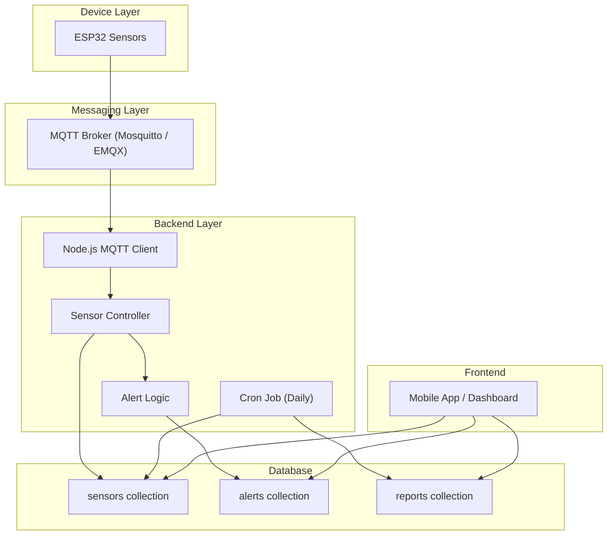
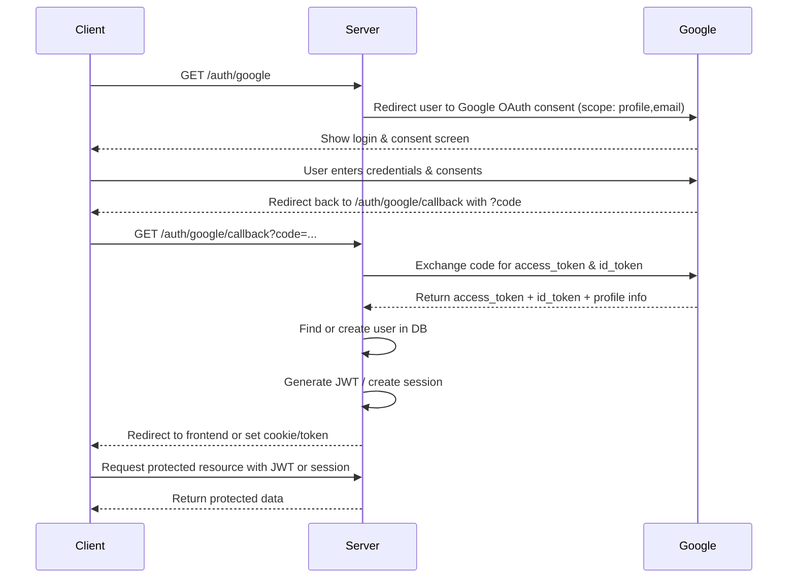
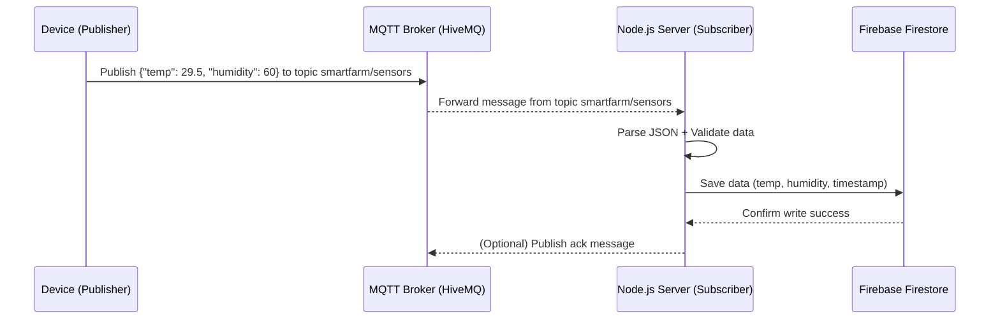
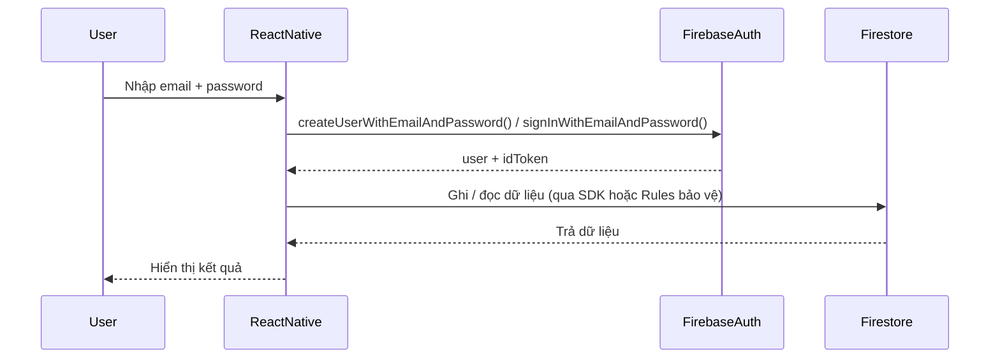

# Smart Agriculture System - Backend

| Tình huống            | mode   | auto.enabled | Ý nghĩa                                 |
| --------------------- | ------ | ------------ | --------------------------------------- |
| User đang test manual | manual | true         | Auto đã config xong nhưng **chưa dùng** |
| User chuyển sang auto | auto   | true         | Auto **được kích hoạt & chạy**          |
| User disable auto     | manual | false        | Auto bị **tắt hoàn toàn**               |
| AI takeover           | ai     | true         | Auto vẫn bật để fallback                |


GET    /devices/:id/mode-config
PATCH  /devices/:id/mode
PATCH  /devices/:id/manual
PATCH  /devices/:id/auto
PATCH  /devices/:id/ai

```
Mỗi ngày →
  Đến giờ schedule →
    Nếu autoConfig.enabled = true →
      Đọc soil moisture →
        Nếu soil < soilMin →
          Bật bơm →
            Chạy tối đa duration phút →
              Hoặc dừng sớm nếu soil ≥ soilMax
```

Có 2 lý do chính giải thích vì sao trong thiết kế alert/notification của hệ thống IoT (như smart agriculture) thường không để nhiều loại type trong một alert, mà thay vào đó tạo một alert cho mỗi loại sensor.

1. Tính rõ ràng & dễ xử lý
2. Khác nhau về thời điểm & điều kiện kích hoạt

Thực tế sensor không bao giờ lệch cùng lúc 100% "đúng một thời điểm".
Ví dụ:
Nhiệt độ có thể vượt ngưỡng lúc 10:01:02,
độ ẩm vượt ngưỡng lúc 10:01:05,
độ ẩm đất vượt ngưỡng lúc 10:01:07.

Nêu cơ chế alert gom vào 1 alert, bạn sẽ gặp vấn đề:
- alert đã gửi cho type 1,
- khi type 2 vượt ngưỡng → “nhét vào alert cũ hay tạo alert mới?”
- nếu nhét vào alert cũ → alert mất tính chính xác theo thời gian
- nếu tạo alert mới → rốt cuộc quay về mô hình nhiều alert

👉 Vì vậy tiêu chuẩn IoT luôn là:
"One alert = One rule = One abnormal condition"



## Flow hoạt động chi tiết

(A) ESP32 → MQTT Broker
- ESP đọc nhiệt độ, độ ẩm, độ ẩm đất mỗi X giây
- Gửi JSON lên topic, ví dụ topic: `smartfarm/{deviceId}/data` 
- Payload:
```
{
  "temperature": 29.3,
  "humidity": 70,
  "soilMoisture": 520,
  "timestamp": 1733049000000
}
```

(B) MQTT Broker → Node.js Backend (Subscriber)
- Node.js chạy 1 MQTT client:
```js
mqttClient.on("message", async (topic, payload) => {
    const data = JSON.parse(payload.toString());

    // Lưu sensors
    await Sensor.create({
        deviceId,
        temperature: data.temperature,
        humidity: data.humidity,
        soilMoisture: data.soilMoisture,
        timestamp: new Date()
    });

    // Gọi trigger
    checkAlerts(deviceId, data);
});
```
- Backend là subscriber theo topic: `smartfarm/+/data`
- Dấu `+` là wildcard để nhận của tất cả `deviceId` → Kết quả: nhận realtime dữ liệu, lưu vào collection `sensors`.

(C) Trigger Alerts – Khi vượt ngưỡng

Sau khi lưu sensor data, backend chạy hàm `checkAlerts()` để sinh cảnh báo.

Demo:
```js
function checkAlerts(deviceId, data) {
    if (data.temperature > 40) {
        createAlert(deviceId, "temperature", `Nhiệt độ quá cao`, data.temperature);
    }

    if (data.humidity < 20) {
        createAlert(deviceId, "humidity", `Độ ẩm quá thấp`, data.humidity);
    }

    if (data.soilMoisture < 300) {
        createAlert(deviceId, "soilMoisture", `Đất quá khô`, data.soilMoisture);
    }
}


async function createAlert(deviceId, type, message, value) {
    await Alert.create({
        deviceId,
        type,
        message,
        value,
        status: "unread",
        createdAt: new Date(),
    });
}

```

(D) Cron job tổng hợp dữ liệu (daily reports)
- Cron chạy 1 lần/ngày, ví dụ 23:59

```js
async function aggregateDailyReport() {
    const devices = await Device.find();

    for (const d of devices) {
        const stats = await Sensor.aggregate([
            {
                $match: {
                    deviceId: d._id,
                    timestamp: {
                        $gte: startOfToday(),
                        $lte: endOfToday(),
                    }
                }
            },
            {
                $group: {
                    _id: null,
                    avgTem: { $avg: "$temperature" },
                    avgHum: { $avg: "$humidity" },
                    maxTem: { $max: "$temperature" },
                    minTem: { $min: "$temperature" },
                }
            }
        ]);

        if (stats.length > 0) {
            await Report.create({
                deviceId: d._id,
                date: formatDay(),
                ...stats[0]
            });
        }
    }
}
```
→ Dashboard chỉ cần GET /reports để hiển thị biểu đồ thống kê.

---



## Overview

Backend của hệ thống được xây dựng hoàn toàn trên **Firebase**, đảm nhiệm các chức năng:

-   Quản lý người dùng (đăng ký, đăng nhập, phân quyền)
-   Lưu trữ và xử lý dữ liệu thiết bị/sensor
-   Thống kê và gửi thông báo tự động (qua Firebase Cloud Functions)
-   Giao tiếp real-time với thiết bị thông qua **MQTT**


---
## MQTT

**MQTT (Message Queuing Telemetry Transport)** là một giao thức truyền thông nhẹ (lightweight) dùng trong IoT. Nó hoạt động theo mô hình **Publish / Subscribe**, nghĩa là:
- Một thiết bị (Publisher) gửi dữ liệu lên một kênh (Topic)
- Một hoặc nhiều thiết bị khác (Subscriber) đăng ký (subscribe) vào topic đó để nhận dữ liệu.

Các thành phần chính trong MQTT
| Thành phần     | Vai trò                                                     | Ví dụ                                  |
| -------------- | ----------------------------------------------------------- | -------------------------------------- |
| **Broker**     | Máy chủ trung tâm — trung gian truyền tin giữa các thiết bị | HiveMQ, Mosquitto, EMQX                |
| **Publisher**  | Gửi dữ liệu lên broker                                      | ESP32 gửi nhiệt độ, độ ẩm              |
| **Subscriber** | Nhận dữ liệu từ broker                                      | Node.js server, hoặc dashboard         |
| **Topic**      | “Kênh” để gửi/nhận dữ liệu                                  | `smartfarm/sensors`, `home/room1/temp` |

Luồng hoạt động tổng quát


---
## Firebase Services Used

### 1. **Firebase Firestore**

-   Cơ sở dữ liệu NoSQL dạng **document - collection**.
-   Dùng để lưu trữ dữ liệu người dùng, thiết bị và dữ liệu cảm biến.
-   Hỗ trợ realtime update, dễ mở rộng và tích hợp với Cloud Functions.

### 2. **Firebase Authentication**

-   Xác thực người dùng qua email/password hoặc token.
-   Bảo mật truy cập API và quản lý quyền user.

Luồng Login/Register bằng Email/Password:


### 3. **Firebase Cloud Functions**

-   Xử lý logic backend (API, trigger khi có thay đổi trong Firestore).
-   Ví dụ: Khi thiết bị gửi dữ liệu mới → trigger lưu vào Firestore → cập nhật dashboard.

### 4. **Firebase Cloud Messaging (FCM)**

-   Gửi thông báo real-time đến app hoặc dashboard khi có sự kiện (ví dụ: cảm biến vượt ngưỡng).

### Firebase Console / SDK (API của Firestore)

1. Firebase Console

Flow:
```
Firebase Console -> Firestore API -> Save
```

2. SDK

> SDK là viết tắt của **Software Development Kit**, dịch sang tiếng Việt là **Bộ công cụ phát triển phần mềm**. Đây là một gói các công cụ, tài nguyên và tài liệu được nhà sản xuất cung cấp để nhà phát triển có thể dễ dàng xây dựng ứng dụng cho một nền tảng, hệ điều hành hoặc ngôn ngữ lập trình cụ thể.

Flow:
```
App -> Firebase SDK -> Firestore API -> Kiểm tra quyền -> Save
```

3. So sánh trực quan

| Tiêu chí                        | Firebase Console                 | Code (SDK)                            |
| ------------------------------- | -------------------------------- | ------------------------------------- |
| Cách thêm                       | Thủ công (UI)                    | Tự động (qua API)                     |
| Flow                            | Gửi yêu cầu trực tiếp từ console | Gửi qua Firebase SDK (HTTP/WebSocket) |
| Bảo mật                         | Không kiểm tra quyền             | Có kiểm tra theo Security Rules       |
| Dữ liệu thời gian (`createdAt`) | Phải tự nhập                     | Có thể dùng `serverTimestamp()`       |
| Dùng cho                        | Test, debug, seed dữ liệu        | App thực tế, automation               |
| Tính mở rộng                    | Không thể mở rộng                | Có thể tích hợp logic phức tạp        |
