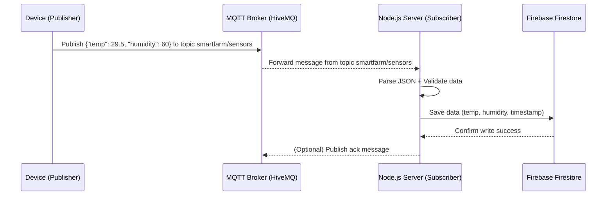
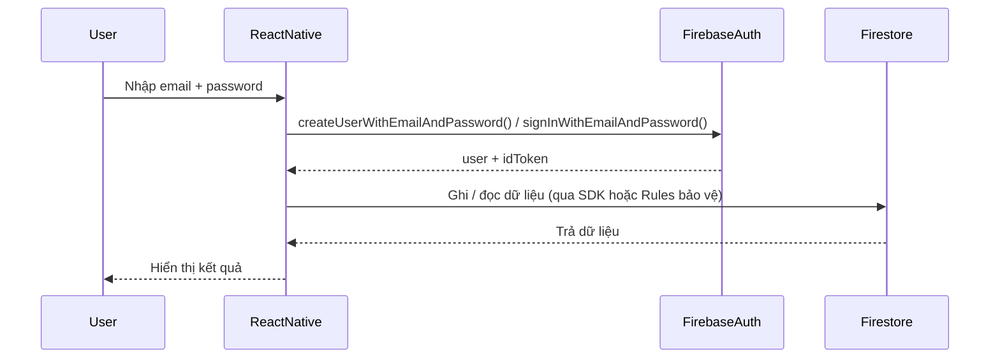

# Smart Agriculture System - Backend

## Overview

Backend của hệ thống được xây dựng hoàn toàn trên **Firebase**, đảm nhiệm các chức năng:

-   Quản lý người dùng (đăng ký, đăng nhập, phân quyền)
-   Lưu trữ và xử lý dữ liệu thiết bị/sensor
-   Thống kê và gửi thông báo tự động (qua Firebase Cloud Functions)
-   Giao tiếp real-time với thiết bị thông qua **MQTT**


---
## MQTT

**MQTT (Message Queuing Telemetry Transport)** là một giao thức truyền thông nhẹ (lightweight) dùng trong IoT. Nó hoạt động theo mô hình **Publish / Subscribe**, nghĩa là:
- Một thiết bị (Publisher) gửi dữ liệu lên một kênh (Topic)
- Một hoặc nhiều thiết bị khác (Subscriber) đăng ký (subscribe) vào topic đó để nhận dữ liệu.

Các thành phần chính trong MQTT
| Thành phần     | Vai trò                                                     | Ví dụ                                  |
| -------------- | ----------------------------------------------------------- | -------------------------------------- |
| **Broker**     | Máy chủ trung tâm — trung gian truyền tin giữa các thiết bị | HiveMQ, Mosquitto, EMQX                |
| **Publisher**  | Gửi dữ liệu lên broker                                      | ESP32 gửi nhiệt độ, độ ẩm              |
| **Subscriber** | Nhận dữ liệu từ broker                                      | Node.js server, hoặc dashboard         |
| **Topic**      | “Kênh” để gửi/nhận dữ liệu                                  | `smartfarm/sensors`, `home/room1/temp` |

Luồng hoạt động tổng quát


---
## Firebase Services Used

### 1. **Firebase Firestore**

-   Cơ sở dữ liệu NoSQL dạng **document - collection**.
-   Dùng để lưu trữ dữ liệu người dùng, thiết bị và dữ liệu cảm biến.
-   Hỗ trợ realtime update, dễ mở rộng và tích hợp với Cloud Functions.

### 2. **Firebase Authentication**

-   Xác thực người dùng qua email/password hoặc token.
-   Bảo mật truy cập API và quản lý quyền user.

Luồng Login/Register bằng Email/Password:


### 3. **Firebase Cloud Functions**

-   Xử lý logic backend (API, trigger khi có thay đổi trong Firestore).
-   Ví dụ: Khi thiết bị gửi dữ liệu mới → trigger lưu vào Firestore → cập nhật dashboard.

### 4. **Firebase Cloud Messaging (FCM)**

-   Gửi thông báo real-time đến app hoặc dashboard khi có sự kiện (ví dụ: cảm biến vượt ngưỡng).

### Firebase Console / SDK (API của Firestore)

1. Firebase Console

Flow:
```
Firebase Console -> Firestore API -> Save
```

2. SDK

> SDK là viết tắt của **Software Development Kit**, dịch sang tiếng Việt là **Bộ công cụ phát triển phần mềm**. Đây là một gói các công cụ, tài nguyên và tài liệu được nhà sản xuất cung cấp để nhà phát triển có thể dễ dàng xây dựng ứng dụng cho một nền tảng, hệ điều hành hoặc ngôn ngữ lập trình cụ thể.

Flow:
```
App -> Firebase SDK -> Firestore API -> Kiểm tra quyền -> Save
```

3. So sánh trực quan

| Tiêu chí                        | Firebase Console                 | Code (SDK)                            |
| ------------------------------- | -------------------------------- | ------------------------------------- |
| Cách thêm                       | Thủ công (UI)                    | Tự động (qua API)                     |
| Flow                            | Gửi yêu cầu trực tiếp từ console | Gửi qua Firebase SDK (HTTP/WebSocket) |
| Bảo mật                         | Không kiểm tra quyền             | Có kiểm tra theo Security Rules       |
| Dữ liệu thời gian (`createdAt`) | Phải tự nhập                     | Có thể dùng `serverTimestamp()`       |
| Dùng cho                        | Test, debug, seed dữ liệu        | App thực tế, automation               |
| Tính mở rộng                    | Không thể mở rộng                | Có thể tích hợp logic phức tạp        |
